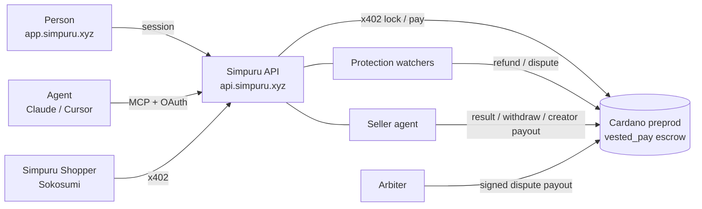

## The parts

| Part | Path | What it does |
| - | - | - |
| API | `apps/api` | Hono on Bun with SQLite. Catalogue, accounts and sessions, the x402 paywall with an in-process facilitator, purchases, the hosted MCP server and its OAuth sign-in |
| Seller agent | `apps/api` | Posts the result hash, withdraws after the unlock time and pays creators their share |
| Protection watchers | `apps/api`, `apps/agent` | Refund or dispute each open protected purchase when needed |
| Arbiter | `apps/arbiter` | Decides disputes from evidence and signs the payout with the arbiter key |
| Escrow builders | `packages/escrow` | Typed datum codecs and one transaction builder per escrow action |
| Shared core | `packages/core` | Types, constants and the hash helpers everyone agrees on |
| MCP (stdio) | `apps/mcp` | An MCP server that runs next to an agent and pays from the agent's own wallet |
| Coworker | `apps/coworker` | Simpuru Shopper, the Sokosumi agent |
| Web app | `apps/web` | Next.js app at app.simpuru.xyz |
| Landing | `apps/landing` | simpuru.xyz |
| Contracts | `contracts` | The escrow deployment record |

## Stack

- Cardano preprod, Blockfrost, Evolution SDK for transactions
- x402 v2: `@x402/cardano`, `@x402/hono`, `@x402/fetch`, `@x402/mcp`
- Masumi `vested_pay` V2 validator, used unchanged, with a reference script on chain
- CIP-30 wallets and CIP-8 signatures for sign-in and signed listings
- Bun workspaces, Turborepo, TypeScript, Biome
- One VPS runs the API and services in Docker; the frontends run on Vercel
